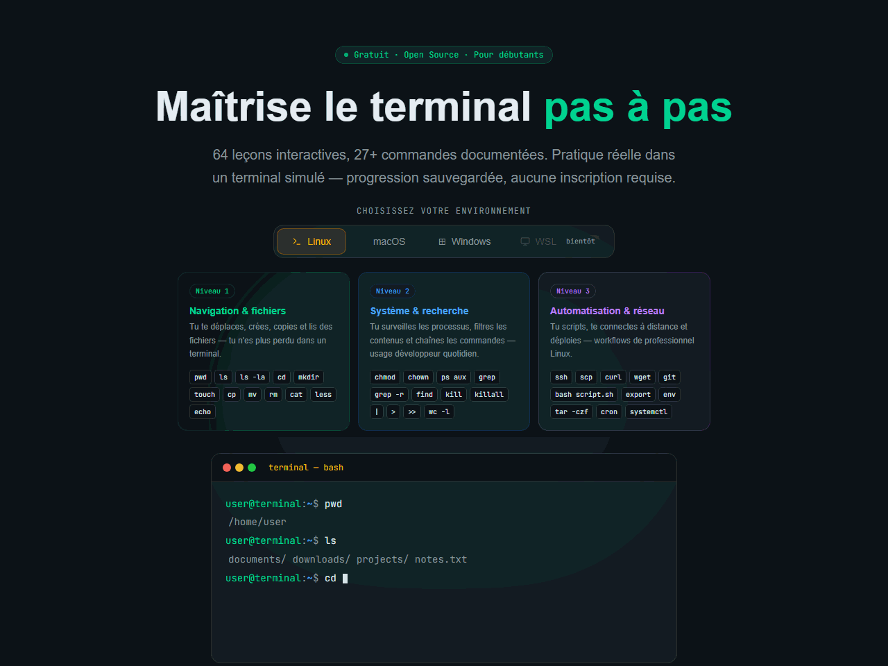
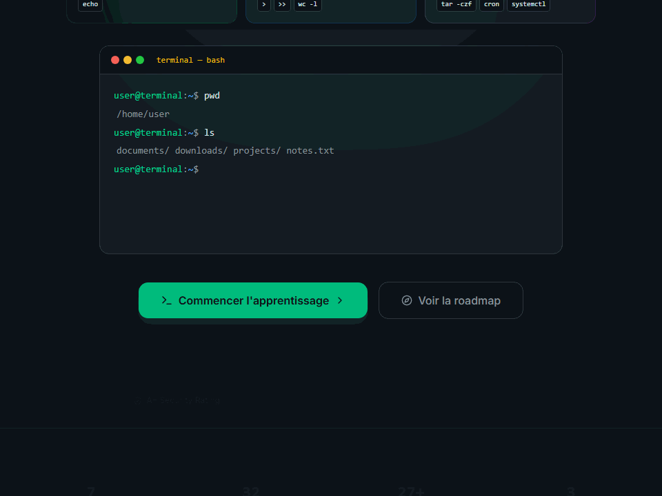

# Terminal Learning

> **Learn the terminal by doing — not just reading.**

[](https://terminallearning.dev)
[](LICENSE)
[](https://vitejs.dev)
[](https://react.dev)
[](https://tailwindcss.com)

---





## The Problem

The terminal is powerful — but also frustrating to learn. Commands look different on Linux, macOS, and Windows. Most tutorials just show you code to copy-paste, with no feedback when something goes wrong. And switching between operating systems? That means starting over.

**Terminal Learning fixes this.** It's a free, open-source web platform where you practice real terminal commands in an interactive environment — with exercises, validation, and contextual help adapted to *your* operating system.

No account required. No setup. Just open it and start learning.

🌐 **[Try it live →](https://terminallearning.dev)**

---

## ✨ Key Features

- 🖥️ **Interactive terminal** — type real commands, get real feedback (not just theory)
- 🌍 **Multi-environment** — learn on Linux, macOS, or Windows — the interface adapts
- 🔒 **Progressive curriculum** — lessons unlock as you master earlier ones
- 💾 **Progress saved automatically** — locally, or synced to the cloud with a free account
- 📖 **Contextual help** — `help <command>` returns usage and examples for your environment
- 🎓 **Designed for everyone** — schools, universities, self-taught developers
- 💸 **100% free, forever** — no paywall, no ads, no catch

---

## 🌍 Environment Switching

Most terminal tutorials assume you're on Linux. Terminal Learning doesn't.

Select your environment and everything adapts — the prompt style, the commands, the exercises, and the hints:

| | Linux | macOS | Windows |
|---|---|---|---|
| **Prompt** | `user@host:~$` | `➜ ~` | `PS C:\Users\user>` |
| **Shell** | bash | zsh (Oh My Zsh style) | PowerShell |
| **Example** | `ls`, `chmod`, `apt` | `ls`, `chmod`, `brew` | `dir`, `Set-ExecutionPolicy`, `winget` |

This makes learning more realistic and less confusing — you practice the exact commands you'll actually use.

> WSL (Windows Subsystem for Linux) support is planned.

---

## 🛠 Tech Stack

| Layer | Technology | Version |
|-------|-----------|---------|
| Bundler | Vite | 6.x |
| UI Framework | React | 18.x |
| Routing | React Router | 7.x |
| Styling | Tailwind CSS | 4.x |
| Components | shadcn/ui (Radix UI) | latest |
| Animations | Motion (Framer Motion) | 12.x |
| Auth & Database | Supabase (PostgreSQL + RLS) | 2.x |
| Error Tracking | Sentry (free tier) | 8.x |
| Tests | Vitest + Playwright | — |
| Deployment | Vercel (free tier) | — |

---

## 📁 Architecture

Full architecture, data flow diagrams, and database schema are documented in [docs/ARCHITECTURE.md](docs/ARCHITECTURE.md).

---

## 🔒 Security

Security is built in from day one:

- **Strict CSP** — no `unsafe-eval`, enforced via `vercel.json`
- **Auth** — Supabase Auth with PKCE flow, JWT rotation, built-in rate limiting
- **Database** — Row Level Security on all tables, anon key only client-side
- **GDPR** — cookieless analytics, privacy page at `/privacy`, no PII in logs
- **CI** — `npm audit` + GitHub Dependabot on every push

Full security policy and vulnerability reporting: [SECURITY.md](SECURITY.md)

---

## 🗺 Roadmap

| Phase | Status | Description |
|-------|--------|-------------|
| **Phase 0** | ✅ Done | Initial deployment on Vercel |
| **Phase 1** | ✅ Done | Landing page, routing, SEO/OpenGraph, GDPR |
| **Phase 2** | ✅ Done | Vercel Analytics + Sentry error monitoring + source maps |
| **Phase 3** | ✅ Done | Supabase Auth + user progress sync |
| **Phase 4** | ✅ Done | Curriculum v2 + multi-environment selection + terminal profiles |
| **Phase 5** | 🔄 In progress | Curriculum expansion: 10 modules, 52 lessons, 876 unit tests + 176 E2E |
| **Phase 5.5** | ✅ Done | Terminal Sentinel — automated security & content audit agents |
| **Phase 7** | ✅ Done | RBAC — student / teacher / institution_admin / super_admin roles |
| **THI-84** | ✅ Done | Public changelog ([/changelog](/changelog)) + project story ([/story](/story)) + trust badges |
| **Maintenance** | 🔄 Ongoing | Security audits (OWASP/CSP/RLS), Sentry monitoring, dependency updates |
| **Phase 6** | 🔮 Planned | Terminal multi-session (tabs) |
| **Phase 8** | 🔮 Planned | Member space — profiles, stats, badges |
| **Phase 9** | 🔮 Planned | Admin panel — real-time health, security center, analytics, RBAC |
| **Phase 10** | 🔮 Planned | Automated content — new commands unlocked every 2 weeks |

Full details in [docs/ROADMAP.md](docs/ROADMAP.md).

---

## ⚙️ Getting Started

### Prerequisites

- Node.js 18+
- npm 9+

### Installation

```bash
git clone https://github.com/thierryvm/TerminalLearning.git
cd TerminalLearning
npm install
cp .env.example .env.local   # add your VITE_SUPABASE_URL + VITE_SUPABASE_ANON_KEY
npm run dev
```

Open [http://localhost:5173](http://localhost:5173) in your browser.

> The app works without Supabase credentials — progress is saved locally. Auth and sync require a Supabase project.

### Build

```bash
npm run build        # Production build → dist/
npm run test         # Unit tests (Vitest)
npm run test:e2e     # E2E tests (Playwright)
```

---

## 🤝 Contributing

Contributions are welcome! Please read [CONTRIBUTING.md](CONTRIBUTING.md) and [docs/CONVENTIONS.md](docs/CONVENTIONS.md) before opening a pull request.

```bash
git checkout -b feature/my-feature
# ... make your changes
git commit -m "feat(scope): description"
gh pr create
```

All PRs must pass CI (type-check → lint → tests → build) before merge.

---

## 💜 Support the Project

Terminal Learning is a volunteer project — free now, free forever.

If it helped you or your students, the best way to support it is:

- ⭐ **Star the repo** — helps visibility on GitHub
- 🐛 **Report bugs** — [open an issue](https://github.com/thierryvm/TerminalLearning/issues)
- 🤝 **Contribute** — code, curriculum, translations, feedback
- 💜 **[GitHub Sponsors](https://github.com/sponsors/thierryvm)** — activated, donations on hold *(pending Solidaris / RIZIV-INAMI authorization)*
- ☕ **[Ko-fi](https://ko-fi.com/thierryvm)** — on hold *(pending Solidaris / RIZIV-INAMI authorization)*

---

## 📄 License

MIT License — see [LICENSE](LICENSE) for details.

---

## Acknowledgments

- UI components from [shadcn/ui](https://ui.shadcn.com/) (MIT)
- Initial design created with [Figma Make](https://www.figma.com/make/)
- Developed with [Claude Code](https://claude.com/claude-code) (Anthropic)
- Icons by [Lucide](https://lucide.dev/)

---

<p align="center">
  Made with ♥ in Belgium &nbsp;·&nbsp;
  <a href="https://terminallearning.dev">Live Demo</a> &nbsp;·&nbsp;
  <a href="https://github.com/thierryvm/TerminalLearning/issues">Report a Bug</a>
</p>
